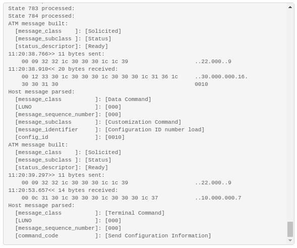
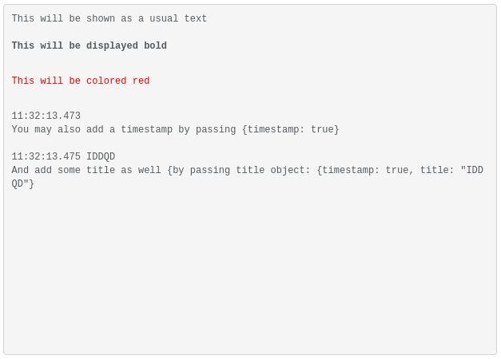

# atm-logging

A simple logging service for electron applications that puts the data into "log-output" object and automatically scrolls the data to the very bottom, so the latest data is displayed in the bottom of the page:


## Usage:

Define the logging area in you html, e.g.:
```html
<pre id="log-output" class="log-output" type="text"></pre>
```

Apply some styling for this area:
```css
.log-output {
  height: 440px;
  color: #575B5E;
  font-size: 12px;
  font-family: monospace;
  white-space: pre-wrap;
  border:1px solid lightgrey;
}
```

Import and use the library:
```javascript
import Log from 'atm-logging';
const log = new Log();

log.info('This will be shown as a usual text');
log.warn('This will be displayed bold');
log.error('This will be colored red');
log.info('You may also add a timestamp by passing {timestamp: true}', {timestamp: true});
log.info('And add some title as well {by passing title object: {timestamp: true, title: "IDDQD"}', {timestamp: true, title: 'IDDQD'});
```


